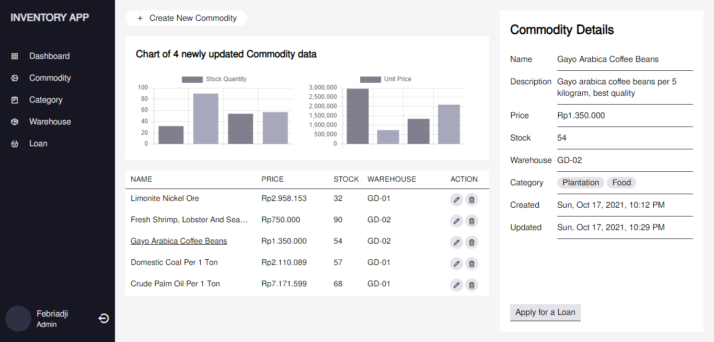

# Inventory App

This is an Inventory application that is designed to manage 📋, organize and supervise all things regarding the purchase and borrowing of goods/commodities. 📦📈

The technology stack I used on this project includes:
- [Node.js](https://nodejs.org/en) & [Express.js](https://expressjs.com)
- [Vue.js](https://vuejs.org)
- [MongoDB](https://www.mongodb.com)
- [GraphQL](https://graphql.org) & [Apollo](https://www.apollographql.com)
- [Webpack](https://webpack.js.org)

# Getting Started
> Note: To run this application you need to install Node.js and @vue/cli on your device.

~~~
git clone https://github.com/febriadj/inventory-mevn

cd inventory-mevn/ && code .
~~~
~~~
npm install && npm update
~~~
Install all dependencies on this project.

~~~
npm run dev
~~~
Run the app in development mode. then open http://localhost:3000 in the browser.

# Screenshot 📸

# Contributing
Contributions make the open source community a great place to learn, inspire and create. I really appreciate every contribution you make.

If you have any suggestions that would make this even better, please fork this repo and pull request. You can also open an issue on this project and don't forget to give this project a star. Thank you.

- Fork this project
- Create a new branch (git checkout -b branchName)
- Commit your changes (git commit -m "Add new features")
- Push to your branch (git push origin branchName)
- Submit a pull request

# Contact
LinkedIn: [linkedin.com/in/febri-adji](https://www.linkedin.com/in/febri-adji)

Phone: +62 851-5670-3982
Email: <iamfebriadji@gmail.com>